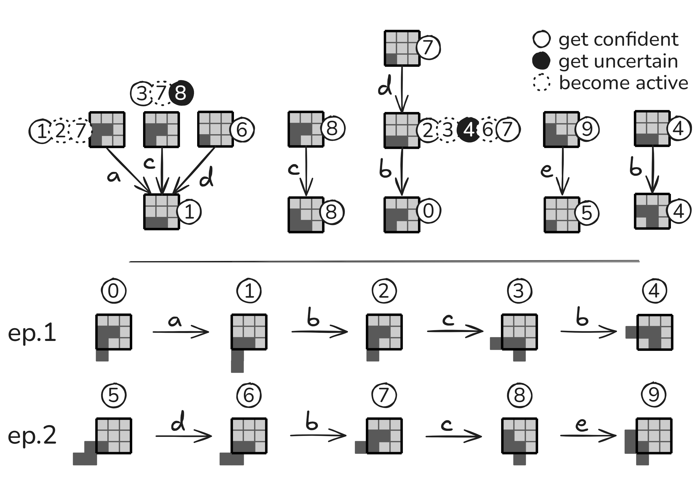

# Online Sensorimotor Sequence‑based Learning Using Predictive Trees

<!-- Badges (optional): e.g., build status, license, arXiv — leave blank intentionally -->

## Table of Contents
- [Overview](#overview)
- [Method](#method)
  - [Principles](#principles)
  - [Predictive Trees](#predictive-trees)
- [Experiments](#experiments)
- [Figure](#figure)
- [Project Links](#project-links)
- [Usage](#usage)
- [Installation](#installation)
- [Requirements](#requirements)
- [Demo](#demo)
- [Citation](#citation)
  - [References](#references)
- [Authors](#authors)
- [License](#license)
- [Acknowledgements](#acknowledgements)
- [Contact](#contact)

## Overview

Artificial agents now outperform humans on many visual and linguistic benchmarks, yet their abilities remain case‑specific due in part to the absence of action‑grounded structure central to human cognition. This gap suggests that perception, action, and prediction must form a tightly coupled feedback loop and that perception be reframed not as passive stimulus reception, but as an active process emerging from the mastery of **sensorimotor contingencies**—systematic relationships between actions and their perceptual consequences [1].

We thus ask: *Can a simple, online structure capture meaningful sensorimotor regularities and foster autonomous object discovery through prediction alone?*  
We explore this by proposing a minimalist yet powerful memory mechanism that incrementally builds predictive sequences based solely on sensorimotor experience.

## Method

### Principles

1. **Sequence‑based Representation for Sensorimotricity**: The world model captures sensorimotor traces of the form “if I observe $o$ and execute $a$, I expect $o'$”, explicitly disambiguating sequences. We focus on the deterministic case as a proof‑of‑concept.
2. **Online Learning for Adaptability**: The model is refined at every time‑step, allowing rapid adaptation to novel contingencies encountered through interaction.
3. **Intrinsic Motivation for Active Exploration**: Without any external reward, the agent is driven by curiosity—maximising predictive accuracy—forcing it to build a comprehensive, task‑agnostic understanding of its environment.

### Predictive Trees



**Figure 1:** Example of the construction of predictive trees for a specific observation–action sequence.

Drawing on insights from adaptive decision‑tree streams [2, 3], we propose a new model based on objects called **Predictive Trees**.

A predictive tree (Fig. 1) is a rooted, labelled digraph that stores only the **minimal** action–observation history needed for reliable forecasting. The root represents the observation the agent seeks to predict; all other nodes hold an earlier observation and a Boolean flag indicating whether the model is confident in the future prediction if it follows the action path from this source node.

At step $t$ the agent activates every node whose observation matches its current perception $o_t$ (dotted circles) and follows the outgoing edge corresponding to the executed action $a_t$. Reaching the root tests the prediction: a failure flips the source node to *unconfident* (black circle), whereas a subsequent success uses backward induction to append a previous observation–action pair to the start node, after which the node becomes *confident* (plain circle).

Extensions therefore arise only on previously unconfident nodes, so the tree "converges" to the shortest prefixes sufficient for prediction, yielding a compact, incrementally constructed memory whose depth adapts to the empirical complexity of the environment.

## Code Structure

The project's code is structured modularly to separate the core learning mechanisms from the environment. The agent logic resides in [`src/predictris/agent/`](src/predictris/agent/), and the predictive tree implementation is in [`src/predictris/learning/`](src/predictris/learning/). This design ensures that the agent is agnostic to the specific world it inhabits, receiving only perception and action functions during initialization.

## Experiments

We evaluate this approach in a minimal yet structured simulation inspired by the game of *Tetris*, implemented in [`src/predictris/tetris/`](src/predictris/tetris/). The environment features a 2‑D grid with a single shape; the agent is equipped with a $3 \times 3$ local sensor and can perform translations and rotations.

The framework supports active online learning through attention‑like processes that prioritise reliable predictive chains, focusing computation on high‑precision inferences and reducing the combinatorial burden of maintaining many hypotheses. Below are detailed results on object recognition and memory compactness for this Tetris model.

## Usage

This project provides a set of scripts to run simulations, train the agent, collect data, and visualize results. All scripts are located in the `scripts/` directory.

### Interactive Simulation

Run an interactive Tetris environment from the agent's perspective where you can manually control a tetromino.

```bash
python scripts/run_tetris.py --tetromino T
```
Use the arrow keys to move and the space key to rotate the piece.

### Training the Agent

Train the agent on a specific set of tetrominos and save the learned predictive trees.

```bash
python scripts/learn.py --tetrominos I J S Z --depth 2 --total-steps 100000 --save --verbose
```
- `--tetrominos`: A list of pieces to include in the training environment.
- `--depth`: The maximum depth of the predictive trees.
- `--total-steps`: The total number of agent-environment interactions.
- `--save`: Saves the agent's state (including trees) to a directory named after the experiment parameters (e.g., `tetrominos=IJSZ_depth=2`).

### Collecting Metrics & Error Rates

During or after training, you can collect performance data.

- **Metrics (Node Counts, Confidences, etc.):**
  ```bash
  python scripts/get_metrics.py --tetrominos I J S Z --depth 2 --total-steps 100000 --nodes-count --confidences --save
  ```

- **Prediction Error Rates:**
  ```bash
  python scripts/get_error_rates.py --tetrominos I J S Z --depth 2 --total-steps 50000 --reps 10 --save
  ```

### Plotting Results

Generate plots from the collected data.

- **Plot Metrics:**
  ```bash
  python scripts/plot_metrics.py --dirs "tetrominos=IJSZ_depth=2" --output "metrics_IJSZ_d2.png"
  ```

- **Plot Error Rates:**
  ```bash
  python scripts/plot_error_rates.py --dirs "tetrominos=IJSZ_depth=2" --step 3 --output "error_rate_IJSZ_d2.png"
  ```

### Visualizing Predictive Trees

Render the learned trees from a saved agent state into an interactive HTML file.

```bash
python scripts/render_trees.py --dir "tetrominos=IJSZ_depth=2"
```
This will generate a `selector.html` file inside the specified directory, allowing you to browse the visualizations.

## Installation

<!-- Add installation steps (dependencies, setup, build) here. -->

## Requirements

<!-- List software/hardware requirements here. -->

## Demo

For a comprehensive walkthrough of the project's features, including data collection, plotting, and visualization, please see the demonstration notebook:

- **[docs/demo.ipynb](docs/demo.ipynb)**

This notebook provides runnable examples for:
1.  Training an agent and observing the growth of its predictive trees.
2.  Measuring and plotting prediction accuracy over time.
3.  Generating interactive visualizations of the agent's internal memory.

## Citation

<!-- Add paper citation and/or BibTeX entry here. -->

### References

1. **O’Regan, J. K. & Noë, A.** *A sensorimotor account of vision and visual consciousness.* Behavioral and Brain Sciences **24** (5), 939–973 (2001).  
2. **Fabbri, A., Armetta, F., Duchêne, É. & Hassas, S.** *A self‑acquiring knowledge process for MCTS.* International Journal on Artificial Intelligence Tools **25** (1), 1660007 (2016).  
3. **Perotto, F. S.** *A computational constructivist model as an anticipatory learning mechanism for coupled agent–environment systems.* (2013).

## Authors

**Lucas Fournier, Jean‑Charles Quinton¹, Mathieu Lefort², Frédéric Armetta²**  
¹ Univ. Grenoble Alpes, CNRS, Grenoble INP, LJK, UMR 5224  
² Univ. Lyon, UCBL, CNRS, INSA Lyon, LIRIS, UMR 5205

This work was carried out within the *Multimodal deep SensoriMotor Representation learning (MeSMRise)* research project (ANR-23-CE23-0021-01, 04/01/24–09/30/28).


## License

<!-- Add license name and a link to the license file here. -->

## Acknowledgements

<!-- Add acknowledgements, funding sources, or project contributors here. -->

## Contact

<!-- Add contact information (email, lab, website) here. -->
