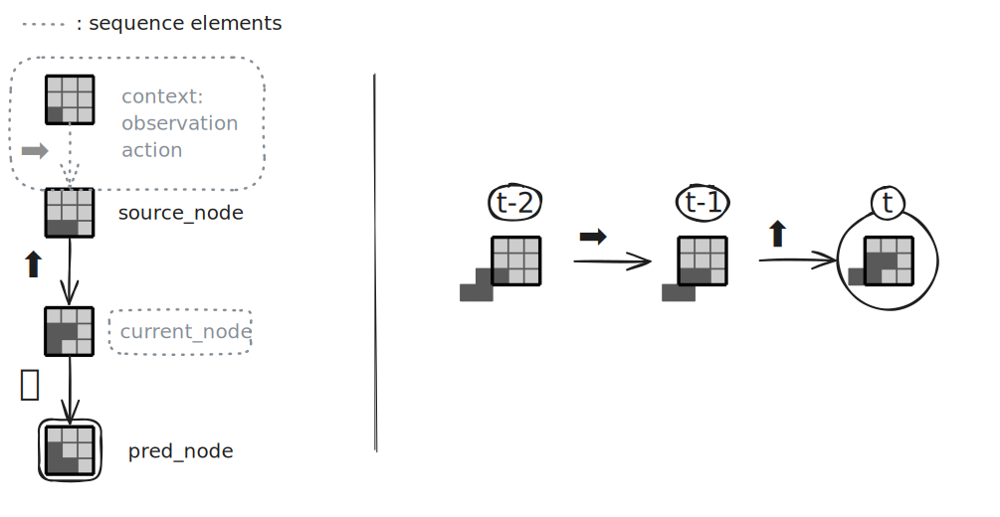
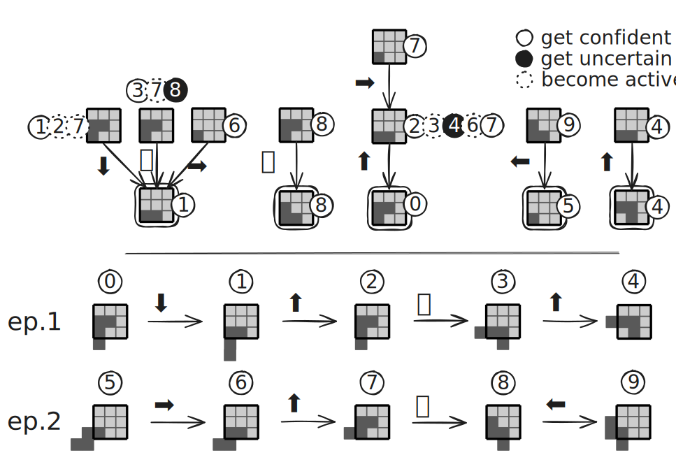

# Online Sensorimotor Sequence‑based Learning Using Prediction Trees

<!-- Badges (optional): e.g., build status, license, arXiv — leave blank intentionally -->

## Table of Contents
- [Overview](#overview)
- [Method](#method)
  - [Principles](#principles)
  - [Prediction Trees](#prediction-trees)
- [Code Structure](#code-structure)
- [Algorithm](#algorithm)
  - [Agent Learning and Prediction](#agent-learning-and-prediction)
- [Experiments](#experiments)
- [Usage](#usage)
  - [Interactive Simulation](#interactive-simulation)
  - [Training the Agent](#training-the-agent)
  - [Collecting Metrics & Error Rates](#collecting-metrics--error-rates)
  - [Plotting Results](#plotting-results)
  - [Visualizing Prediction Trees](#visualizing-prediction-trees)
- [Installation](#installation)
- [Requirements](#requirements)
- [Demo](#demo)
- [Citation](#citation)
  - [References](#references)
- [Authors](#authors)
- [License](#license)
- [Acknowledgements](#acknowledgements)

## Overview

Artificial agents now outperform humans on many visual and linguistic benchmarks, yet their abilities remain case‑specific due in part to the absence of action‑grounded structure central to human cognition. This gap suggests that perception, action, and prediction must form a tightly coupled feedback loop and that perception be reframed not as passive stimulus reception, but as an active process emerging from the mastery of **sensorimotor contingencies**—systematic relationships between actions and their perceptual consequences [1].

We thus ask: *Can a simple, online structure capture meaningful sensorimotor regularities and foster autonomous object discovery through prediction alone?*  
We explore this by proposing a minimalist yet powerful memory mechanism that incrementally builds predictive sequences based on sensorimotor experience.

## Method

### Principles

* **P1 — Prediction as Intrinsic Motivation**: Without any external reward, the agent is driven by curiosity—maximising predictive accuracy—forcing it to build a comprehensive, task‑agnostic understanding of its environment.
* **P2 — Sequence‑based Representation for Sensorimotricity**: The world model captures sensorimotor traces of the form “if I observe $o$ and execute $a$, I expect $o'$”, explicitly disambiguating situations and making the model highly explainable. We focus on the deterministic case as a proof‑of‑concept.
* **P3 — Online Learning for Adaptability**: The model is refined at every time‑step through interaction, making the learning process active rather than passive.

### Prediction Trees

Drawing on insights from adaptive decision‑tree streams [2, 3], we propose a model using several new objects defined as follows.

The fundamental object we use in our model is called a `PredictionPath`.

Following **P1**, a prediction path predicts the perceived result of a chosen action in a given situation. For a vision-only agent, this perception is simply its next observation $o$ and we consider this case from now onwards. The prediction is encoded in a `prediction_node` (Fig. 1) that is connected to the agent's representation of the situation and that asserts “given this situation, the next observation will be $o$.”

Following **P2**, the agent's representation of a situation takes the form of an observation–action sequence that alternates observations (represented as nodes) and actions (represented as labelled, directed edges) and that ultimately lead to the prediction node. We refer to the first observation node of a sequence—at which the agent recognizes the prediction path “begins”—as the `source_node` (Fig. 1).

As observations and actions happen, paths get traversed during so-called `Sequence`s. A sequence starts when the source node corresponds to the current observation, which is then marked as `active`. This label is then transmitted down the path as the sequence gets longer until either the sequence doesn't match the observations and actions anymore, or the path ends and the prediction node becomes active.

Finally, following **P3**, the prediction paths are created incrementally through interaction. Intuitively, when the situation is simple the paths should be short; when the situation is ambiguous the paths should be longer and carry more recent interaction to result in a confident prediction.  
To implement that behavior, each path has a `confidence` boolean state and each sequence carries a `context`—the (observation, action) pair that occurred just before the start of the sequence at the source node (Fig. 1). These attributes determine how the agent learns from a prediction when a prediction node becomes active:
* if the path is *uncertain* but the prediction is correct, a new path is created using the context of the sequence by copying the existing path and prepending a new node (observation) to the source node via a new edge (action); the original path then becomes *confident*.
* if the prediction is wrong, the path becomes *uncertain* until further evidence justifies extension.

This online update rule ensures longer paths are only created when experience proves additional context is required.



**Figure 1:** Example of a prediction path with a sequence (grey dots) activated by a specific observation-action history.

While conceptually sound, we saw two flaws in these prediction paths:
1. Asymptotically, an agent creates as many paths as there are “unique” situations.
2. In the adequate setting, a short path and a longer path that extends it will both activate the same prediction. We only want to consider the prediction by the long path as it has more context.

We address these problems by introducing `PredictionTree`s. A prediction tree (Fig. 2) is a labelled, directed tree that stores all prediction paths with the same observation as prediction by merging them from the prediction node upwards.

> **Remark:** Every edge of such a tree being directed towards the common prediction node, the graph can also be called an "in-tree" and this node can be considered the root of the tree.

These trees have the following properties:
* **P1**: Each path from any node to the prediction node (or root) of a prediction tree is a prediction path as defined before.
* **P2**: Each prediction path can be uniquely identified by its source node in a prediction tree. We thus associate the confidence state and 


only the **minimal** action–observation history needed for reliable forecasting. The root represents the observation the agent seeks to predict; all other nodes hold an earlier observation and a Boolean flag indicating whether the model is confident in the future prediction if it follows the action path from this source node.



**Figure 2:** Example of the construction of prediction trees for a specific observation–action history with timesteps.

At step $t$ the agent activates every node whose observation matches its current perception $o_t$ (dotted circles) and follows the outgoing edge corresponding to the executed action $a_t$. Reaching the root tests the prediction: a failure flips the source node to *uncertain* (black circle), whereas a subsequent success uses backward induction to append a previous observation–action pair to the start node, after which the node becomes *confident* (plain circle).

Extensions therefore arise only on previously uncertain nodes, so the tree "converges" to the shortest prefixes sufficient for prediction, yielding a compact, incrementally constructed memory whose depth adapts to the empirical complexity of the environment.

## Algorithm

### Agent Learning and Prediction

We outline the pseudocode for the agent's learning process, focusing on how it builds and utilizes a forest of prediction trees to understand its environment.

**Data Structures:**

*   `PredictionForest (F)`: A collection of `PredictionTree`s, indexed by the observation they predict.
*   `Sequences (S)`: A mapping from each `PredictionTree` in `F` to a set of `Sequence` objects currently being tracked within that tree.
*   `Sequence`: A tuple `(activeNode, sourceNode, context)` representing a sequence through a `PredictionTree`.
*   `Context`: A tuple `(previousObservation, action)` that led to the activation of a sequence at its `sourceNode`.

---

#### **Algorithm 1: Agent Learning Step**

**Requires:** Agent's internal state: `PredictionForest F`, `Sequences S`, `previousObservation o_prev`.

> 1.  *// Action Selection*
> 2.  `a` ← Select a random action from the set of all possible actions.
> 3.  Execute action `a` in the environment.
> 4.  
> 5.  *// Context Update*
> 6.  `C_current` ← `(o_prev, a)`
> 7.  
> 8.  *// Perception*
> 9.  `o_curr` ← Perceive the new observation from the environment.
> 10. 
> 11. *// Tree Creation*
> 12. **If** no `PredictionTree` exists for `o_curr` in `F`:
> 13. &nbsp;&nbsp;&nbsp;&nbsp;`T_new` ← Create a new `PredictionTree` for `o_curr`.
> 14. &nbsp;&nbsp;&nbsp;&nbsp;Add `T_new` to `F`.
> 15. 
> 16. *// Context Propagation*
> 17. `S_new` ← an empty mapping for new active sequences.
> 18. **For each** `PredictionTree T` in `F`:
> 19. &nbsp;&nbsp;&nbsp;&nbsp;`S_new[T]` ← **UpdateSequencesForTree**(`T`, `o_curr`, `a`, `S[T]`, `C_current`)
> 20. 
> 21. *// State Update*
> 22. `S` ← `S_new`
> 23. `o_prev` ← `o_curr`

---

#### **Algorithm 2: UpdateSequencesForTree**

**Requires:** A `PredictionTree T`, current observation `o_curr`, last action `a`, the set of active sequences for the tree `S_T`, and the current context `C_current`.
**Returns:** The updated set of active sequences for the tree.

> 1.  `M` ← Set of all nodes in `T` that match observation `o_curr`.
> 2.  `S'_updated` ← an empty set.
> 3.  
> 4.  **For each** active sequence `s` in `S_T`:
> 5.  &nbsp;&nbsp;&nbsp;&nbsp;`(n_next, a_edge)` ← Get the successor node and action from the edge leaving `s.activeNode`.
> 6.  &nbsp;&nbsp;&nbsp;&nbsp;**If** `a_edge` = `a`:
> 7.  &nbsp;&nbsp;&nbsp;&nbsp;&nbsp;&nbsp;&nbsp;&nbsp;*// Avoid paths with a different action from the one chosen*
> 8.  &nbsp;&nbsp;&nbsp;&nbsp;&nbsp;&nbsp;&nbsp;&nbsp;**If** `n_next` is the prediction node of `T`:
> 9.  &nbsp;&nbsp;&nbsp;&nbsp;&nbsp;&nbsp;&nbsp;&nbsp;&nbsp;&nbsp;&nbsp;&nbsp;`isCorrect` ← (`o_curr` matches the observation predicted by `T`).
> 10.  &nbsp;&nbsp;&nbsp;&nbsp;&nbsp;&nbsp;&nbsp;&nbsp;&nbsp;&nbsp;&nbsp;&nbsp;**UpdatePrediction**(`T`, `s.sourceNode`, `s.context`, `isCorrect`).
> 11. &nbsp;&nbsp;&nbsp;&nbsp;&nbsp;&nbsp;&nbsp;**Else if** `n_next` is in `M`:
> 12. &nbsp;&nbsp;&nbsp;&nbsp;&nbsp;&nbsp;&nbsp;&nbsp;&nbsp;&nbsp;&nbsp;*// Propagate the paths that coincide with the current situation*
> 13. &nbsp;&nbsp;&nbsp;&nbsp;&nbsp;&nbsp;&nbsp;&nbsp;&nbsp;&nbsp;&nbsp;`s.activeNode` ← `n_next`.
> 14. &nbsp;&nbsp;&nbsp;&nbsp;&nbsp;&nbsp;&nbsp;&nbsp;&nbsp;&nbsp;&nbsp;Add `s` to `S'_updated`.
> 15. &nbsp;&nbsp;&nbsp;&nbsp;&nbsp;&nbsp;&nbsp;&nbsp;&nbsp;&nbsp;&nbsp;Remove `n_next` from `M`.
> 16. 
> 17. **For each** remaining node `n_match` in `M`:
> 18. &nbsp;&nbsp;&nbsp;&nbsp;`s_new` ← Create a new `Sequence(n_match, n_match, C_current)`.
> 19. &nbsp;&nbsp;&nbsp;&nbsp;Add `s_new` to `S'_updated`.
> 20. 
> 21. **Return** `S'_updated`.

---

#### **Algorithm 3: UpdatePrediction**

**Requires:** A `PredictionTree T`, an `sourceNode`, a `context`, and a boolean `isCorrect`.

> 1.  **If** `isCorrect` is `False`:
> 2.  &nbsp;&nbsp;&nbsp;&nbsp;*// The prediction was wrong, so this path is no longer considered reliable.*
> 3.  &nbsp;&nbsp;&nbsp;&nbsp;Set `sourceNode.confident` to `False`.
> 4.  **Else if** `sourceNode.confident` is `False`:
> 5.  &nbsp;&nbsp;&nbsp;&nbsp;*// The prediction was right although this path was not considered reliable.*
> 6.  &nbsp;&nbsp;&nbsp;&nbsp;`o_context`, `a_context` ← `context`.
> 7.  &nbsp;&nbsp;&nbsp;&nbsp;*// Reinforce the tree by adding the context that led to the correct prediction.*
> 8.  &nbsp;&nbsp;&nbsp;&nbsp;**If** a path `(o_context) --a_context--> (sourceNode)` does not already exist in `T`:
> 9.  &nbsp;&nbsp;&nbsp;&nbsp;&nbsp;&nbsp;&nbsp;&nbsp;`n_new` ← Create a new node in `T` representing `o_context`.
> 10. &nbsp;&nbsp;&nbsp;&nbsp;&nbsp;&nbsp;&nbsp;&nbsp;Add a directed edge from `n_new` to `sourceNode`, labeled with action `a_context`.
> 11. &nbsp;&nbsp;&nbsp;&nbsp;*// The path has been reinforced and is now considered confident.*
> 12. &nbsp;&nbsp;&nbsp;&nbsp;Set `sourceNode.confident` to `True`.

## Code Structure

The project's code is structured modularly to separate the core learning mechanisms from the environment. The agent learning and prediction logic using prediction trees resides in [`src/predictris/agent/`](src/predictris/agent/), whereas the tetris environment implementation resides in [`src/predictris/tetris/`](src/predictris/tetris/). This design ensures that the agent is agnostic to the specific world it inhabits, receiving only perception and action functions during initialization.

## Experiments

We evaluate this approach in a minimal yet structured simulation inspired by the game of *Tetris*. The environment features a 2‑D grid with a single shape; the agent is equipped with a $3 \times 3$ local sensor and can perform translations and rotations.

The framework supports active online learning through attention‑like processes that prioritise reliable predictive chains, focusing computation on high‑precision inferences and reducing the combinatorial burden of maintaining many hypotheses. Below are detailed results on object recognition and memory compactness for this Tetris model.

## Usage

This project provides a set of scripts to run simulations, train the agent, collect data, and visualize results. All scripts are located in the `scripts/` directory.

### Interactive Simulation

Run an interactive Tetris environment from the agent's perspective where you can manually control a tetromino.

```bash
python scripts/run_tetris.py --tetromino T
```
Use the arrow keys to move and the space key to rotate the piece.

### Training the Agent

Train the agent on a specific set of tetrominos and save the learned prediction trees.

```bash
python scripts/learn.py --tetrominos I J S Z --depth 2 --total-steps 100000 --save --verbose
```
- `--tetrominos`: A list of pieces to include in the training environment.
- `--depth`: The maximum depth of the prediction trees.
- `--total-steps`: The total number of agent-environment interactions.
- `--save`: Saves the agent's state (including trees) to a directory named after the experiment parameters (e.g., `tetrominos=IJSZ_depth=2`).

### Collecting Metrics & Error Rates

During or after training, you can collect performance data.

- **Metrics (Node Counts, Confidences, etc.):**
  ```bash
  python scripts/get_metrics.py --tetrominos I J S Z --depth 2 --total-steps 100000 --nodes-count --confidences --save
  ```

- **Prediction Error Rates:**
  ```bash
  python scripts/get_error_rates.py --tetrominos I J S Z --depth 2 --total-steps 50000 --reps 10 --save
  ```

### Plotting Results

Generate plots from the collected data.

- **Plot Metrics:**
  ```bash
  python scripts/plot_metrics.py --dirs "tetrominos=IJSZ_depth=2" --output "metrics_IJSZ_d2.png"
  ```

- **Plot Error Rates:**
  ```bash
  python scripts/plot_error_rates.py --dirs "tetrominos=IJSZ_depth=2" --step 3 --output "error_rate_IJSZ_d2.png"
  ```

### Visualizing Prediction Trees

Render the learned trees from a saved agent state into an interactive HTML file.

```bash
python scripts/render_trees.py --dir "tetrominos=IJSZ_depth=2"
```
This will generate a `selector.html` file inside the specified directory, allowing you to browse the visualizations.

## Installation

<!-- Add installation steps (dependencies, setup, build) here. -->

## Requirements

<!-- List software/hardware requirements here. -->

## Demo

For a comprehensive walkthrough of the project's features, including data collection, plotting, and visualization, please see the demonstration notebook:

- **[docs/demo.ipynb](docs/demo.ipynb)**

This notebook provides runnable examples for:
1.  Training an agent and observing the growth of its prediction trees.
2.  Measuring and plotting prediction accuracy over time.
3.  Generating interactive visualizations of the agent's internal memory.

## Citation

<!-- Add paper citation and/or BibTeX entry here. -->

### References

1. **O’Regan, J. K. & Noë, A.** *A sensorimotor account of vision and visual consciousness.* Behavioral and Brain Sciences **24** (5), 939–973 (2001).  
2. **Fabbri, A., Armetta, F., Duchêne, É. & Hassas, S.** *A self‑acquiring knowledge process for MCTS.* International Journal on Artificial Intelligence Tools **25** (1), 1660007 (2016).  
3. **Perotto, F. S.** *A computational constructivist model as an anticipatory learning mechanism for coupled agent–environment systems.* (2013).

## Authors

**Lucas Fournier**, in collaboration with **Jean‑Charles Quinton¹**, **Mathieu Lefort²** and **Frédéric Armetta²**  
¹ Univ. Grenoble Alpes, CNRS, Grenoble INP, LJK, UMR 5224  
² Univ. Lyon, UCBL, CNRS, INSA Lyon, LIRIS, UMR 5205

This work was carried out within the scope of the *Multimodal deep SensoriMotor Representation learning (MeSMRise)* research project (ANR-23-CE23-0021-01, 04/01/24–09/30/28).


## License

<!-- Add license name and a link to the license file here. -->

## Acknowledgements

<!-- Add acknowledgements, funding sources, or project contributors here. -->