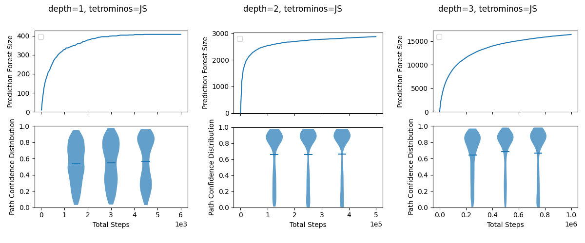
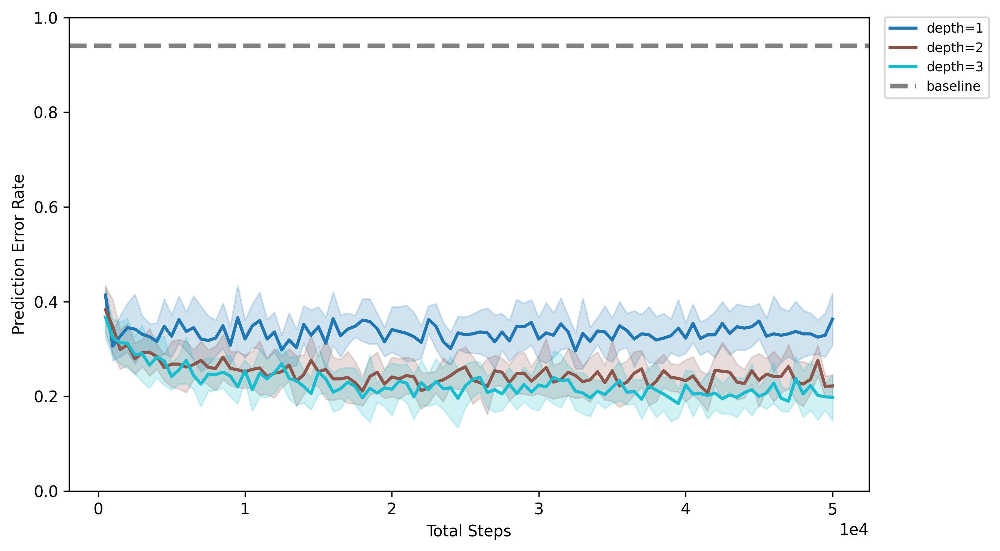

## Experiments

We evaluate this approach in a minimal yet structured simulation inspired by the game of *Tetris*. The environment features a 2‑D grid with a single shape; the agent is equipped with a $3 \times 3$ local sensor and can perform translations and rotations.

The framework supports active online learning through attention‑like processes that prioritise reliable predictive chains, focusing computation on high‑precision inferences and reducing the combinatorial burden of maintaining many hypotheses. Below are detailed results on object recognition and memory compactness for this Tetris model.

### Parameters

* `depth`: The `depth` parameter serves as a maximum length for any prediction path within a `PredictionTree`. It is a hyperparameter that caps the complexity of the agent's learned models by limiting how much historical context can be stored in a single prediction path.

### Plots

* Confidence Score: The reliability of each predictive path is quantified by a `confidence` score. From a Bayesian perspective, this score represents the posterior mean of the probability that a prediction is correct, modeled using a Beta-Bernoulli framework. Each node starts with a $Beta(1, 1)$ prior, corresponding to an initial confidence of 0.5. With each evaluation, this belief is updated. The confidence is calculated as $(k+1)/(n+2)$, where $k$ is the number of correct predictions and $n$ is the total number of evaluations. This method, known as Laplace's rule of succession, provides a smoothed estimate of reliability, preventing premature certainty from a small number of observations. Thus, this confidence score acts as an intrinsic, self-supervised reliability signal that separates well-supported predictive chains from weak ones.

* Error Rate: The error rate plots aggregate data from multiple independent runs (repetitions) for each experimental configuration. The solid line in the plots represents the mean prediction success rate across these repetitions. The shaded area corresponds to one standard deviation from the mean, illustrating the variability of the results. This provides a comprehensive view of both the agent's average performance

### Figures

**Figure 1: Forest growth and confidence evolution across depths**

Panels (a–c) summarize the effect of increasing the maximum path depth (`depth` = 1, 2, 3) on the prediction forest built under uniformly random actions. In each panel, the **top subplot** reports forest size (number of stored paths) versus interaction steps; the **bottom subplot** shows violin plots of the **path-confidence** distribution—defined as the Laplace-smoothed posterior $(k+1)/(n+2)$ for the next-symbol prediction—measured at three chronological checkpoints. Forest size grows rapidly at first and then more slowly, with larger depth budgets yielding markedly larger forests and later saturation, as expected from the cap on path length. Across time, the confidence distributions exhibit a systematic upward drift: probability mass increasingly concentrates above **0.7**, indicating a growing fraction of reliably predictive paths. A non-trivial population below **0.7** persists at all depths; this is expected because the distributions aggregate **all** paths present at a given time, from short prefixes (length 1) through the longest allowed paths, and these short contexts remain comparatively ambiguous. Within the low-confidence region, values are dispersed rather than forming a narrow cluster (i.e., more evenly spread below 0.7 than concentrated near 0.3). Overall, deeper histories enlarge representational capacity and accelerate the shift toward higher confidence, while preserving a residual tail from inherently ambiguous short contexts.

**Figure 2: Prediction error over time**

Mean prediction error rate versus steps under uniformly random actions, with shaded bands indicating ±1 standard deviation across runs; a trivial baseline predictor is shown as a dashed line. Error decreases with experience for all depths, and deeper forests (depth 3, then 2) achieve consistently lower error than shallower ones (depth 1) throughout the horizon. The separation of the curves relative to the one-standard-deviation bands conveys the reliability of the depth effect without additional hypothesis testing.

### What the figures show

The figures show results for the Tetris-like environment with two tetrominos (“J” and “S”). For each maximum path **depth** ∈ {1,2,3}, a panel plots the cumulative number of **nodes** stored in the prediction forest as interaction proceeds; another panel shows the distribution of node **confidence** values at several time points. A final panel summarizes **prediction success rate** over time (mean ±1 s.d. across runs).

Great notes — here’s a tightened, conservative read that folds them in and emphasizes the confidence dynamics.

### Prediction-forest growth

Forest size grows rapidly and then with diminishing increments. Allowing deeper paths expands capacity: a few × 10² nodes for depth 1, \~3 × 10³ for depth 2, and \~1.6 × 10⁴ for depth 3 over the shown horizons.

### Confidence distributions

* **Distribution shape:** a **high-confidence group** (typically > 0.7–0.8) emerges and strengthens with experience, while **low-confidence paths** are spread more evenly **below 0.7**.
* **Temporal trend and effect of depth:** across the three time snapshots in each panel, mass shifts upward: the share above 0.7 increases, and the mid-range (≈0.4–0.7) thins. Larger depth budgets accelerate this shift by offering longer disambiguating histories, yet a non-trivial tail below 0.7 remains at all depths.

### Prediction error

Mean error declines with experience for all depths, with depth 3 < depth 2 < depth 1 over most of the horizon.

### Takeaways

* With time and depth, confidence naturally partitions paths into **reliable** (> 0.7) and **unreliable** (< 0.7) categories that represent the complexity distribution of the environment.
* Increasing depth enlarges memory and lowers error with diminishing returns from depth 2→3 over the explored horizon.
* Because trajectories are random, these summaries speak to unsupervised exploration. Purpose-designed probe sequences with controlled ambiguity (rather than purely random moves) would allow a cleaner measurement of how prediction accuracy scales with controllable path complexity.