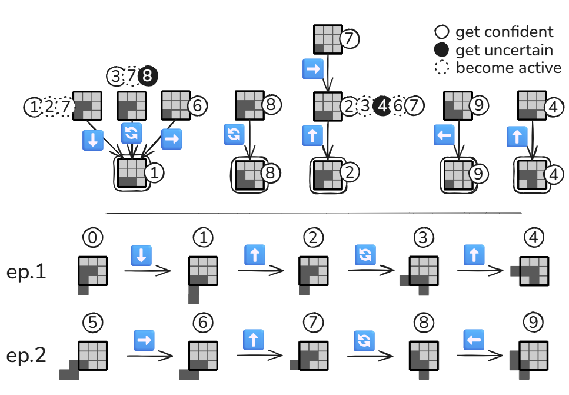

# Online Sensorimotor Sequence‑based Learning Using Predictive Trees

**Lucas Fournier, Jean‑Charles Quinton¹, Mathieu Lefort², Frédéric Armetta²**  
¹ Univ. Grenoble Alpes, CNRS, Grenoble INP, LJK, UMR 5224  
² Univ. Lyon, UCBL, CNRS, INSA Lyon, LIRIS, UMR 5205  

## Abstract

Artificial agents now outperform humans on many visual and linguistic benchmarks, yet their abilities remain case‑specific due in part to the absence of action‑grounded structure central to human cognition. This gap suggests that perception, action, and prediction must form a tightly coupled feedback loop and that perception be reframed not as passive stimulus reception, but as an active process emerging from the mastery of **sensorimotor contingencies**—systematic relationships between actions and their perceptual consequences [1].

We thus ask: *Can a simple, online structure capture meaningful sensorimotor regularities and foster autonomous object discovery through prediction alone?*  
We explore this by proposing a minimalist yet powerful memory mechanism that incrementally builds predictive sequences based solely on sensorimotor experience.

## 1. Principles

Our architecture is grounded in three principles:

1. **Sequence‑based Representation for Sensorimotricity**: The world model captures sensorimotor traces of the form “if I observe $o$ and execute $a$, I expect $o'$”, explicitly disambiguating sequences. We focus on the deterministic case as a proof‑of‑concept.
2. **Online Learning for Adaptability**: The model is refined at every time‑step, allowing rapid adaptation to novel contingencies encountered through interaction.
3. **Intrinsic Motivation for Active Exploration**: Without any external reward, the agent is driven by curiosity—maximising predictive accuracy—forcing it to build a comprehensive, task‑agnostic understanding of its environment.

## 2. Model

Drawing on insights from adaptive decision‑tree streams [2, 3], we propose a new model based on objects called **Predictive Trees**.

A predictive tree (Fig. 1) is a rooted, labelled digraph that stores only the **minimal** action–observation history needed for reliable forecasting. The root represents the observation the agent seeks to predict; all other nodes hold an earlier observation and a Boolean flag indicating whether the model is confident in the future prediction if it follows the action path from this source node.

At step $t$ the agent activates every node whose observation matches its current perception $o_t$ (dotted circles) and follows the outgoing edge corresponding to the executed action $a_t$. Reaching the root tests the prediction: a failure flips the source node to *unconfident* (black circle), whereas a subsequent success uses backward induction to append a previous observation–action pair to the start node, after which the node becomes *confident* (plain circle).

Extensions therefore arise only on previously unconfident nodes, so the tree "converges" to the shortest prefixes sufficient for prediction, yielding a compact, incrementally constructed memory whose depth adapts to the empirical complexity of the environment.

## 3. Experiments

We evaluate this approach in a minimal yet structured simulation inspired by the game of *Tetris*. The environment features a 2‑D grid with a single shape; the agent is equipped with a $3 \times 3$ local sensor and can perform translations and rotations.

The framework supports active online learning through attention‑like processes that prioritise reliable predictive chains, focusing computation on high‑precision inferences and reducing the combinatorial burden of maintaining many hypotheses. Detailed results on object recognition and memory compactness for this Tetris model appear in [4].

**Figure 1:** Example of the construction of predictive trees for a specific observation–action sequence.

## References

1. **O’Regan, J. K. & Noë, A.** *A sensorimotor account of vision and visual consciousness.* Behavioral and Brain Sciences **24** (5), 939–973 (2001).  
2. **Fabbri, A., Armetta, F., Duchêne, É. & Hassas, S.** *A self‑acquiring knowledge process for MCTS.* International Journal on Artificial Intelligence Tools **25** (1), 1660007 (2016).  
3. **Perotto, F. S.** *A computational constructivist model as an anticipatory learning mechanism for coupled agent–environment systems.* (2013).  
4. **Fournier, L.** *Predictris* (2025). <https://github.com/LucasAFournier/predictris>