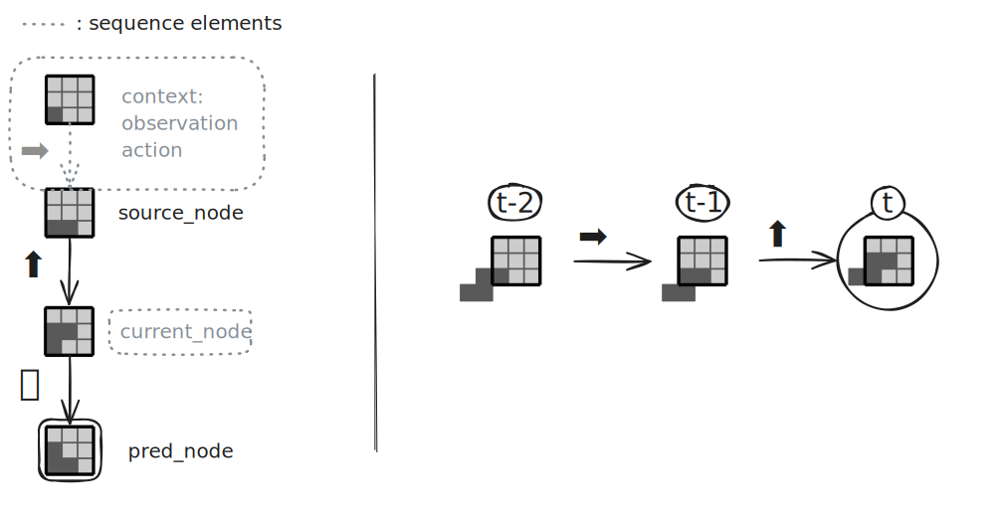
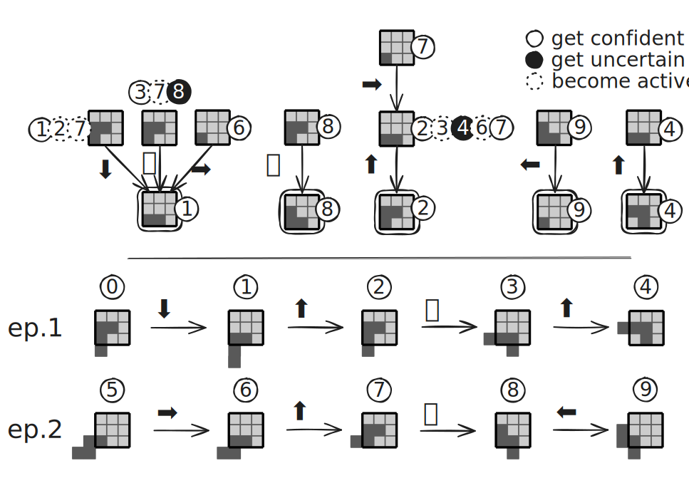

# Online Sensorimotor Sequence‑based Learning Using Prediction Trees

**Lucas Fournier**, in collaboration with **Jean‑Charles Quinton¹**, **Mathieu Lefort²** and **Frédéric Armetta²**  
¹ Univ. Grenoble Alpes, CNRS, Grenoble INP, LJK, UMR 5224  
² Univ. Lyon, UCBL, CNRS, INSA Lyon, LIRIS, UMR 5205

This work was carried out within the scope of the *Multimodal deep SensoriMotor Representation learning (MeSMRise)* research project (ANR-23-CE23-0021-01, 04/01/24–09/30/28).

## Abstract

Artificial agents now outperform humans on many visual and linguistic benchmarks, yet their abilities remain case‑specific due in part to the absence of action‑grounded structure central to human cognition. This gap suggests that perception, action, and prediction must form a tightly coupled feedback loop and that perception be reframed not as passive stimulus reception, but as an active process emerging from the mastery of **sensorimotor contingencies**—systematic relationships between actions and their perceptual consequences [@ORegan2001].

We thus ask: *Can a simple, online structure capture meaningful sensorimotor regularities and foster autonomous object discovery through prediction alone?*  
To address this question, we explore a minimalist memory mechanism that incrementally builds predictive sequences based on sensorimotor experience.

## Introduction

Artificial perception is often trained passively on large datasets, which limits generalisation beyond specific benchmarks. In contrast, biological cognition develops by interacting with the world, learning regularities through action–perception cycles. This work studies whether an online, sequence‑based representation can encode such regularities and support autonomous structure discovery without extrinsic rewards. To this end, we make the following contributions.

### Contributions

*   We introduce **Prediction Paths** and **Prediction Trees**, novel data structures that store and update sensorimotor sequences online, driven solely by predictive success.
*   We propose a scalable activation mechanism that efficiently selects which sequences to track at each timestep, with a confidence‑aware variant for attentional focus.
*   We provide algorithms and a minimal environment inspired by *Tetris* to empirically study the model's predictive accuracy and memory compactness.

## Background and Design Principles

Our approach is grounded in established theories of embodied cognition and online learning. We first articulate the core design principles that guide our model, then review the relevant literature that informs these principles.

### Design Principles

We articulate three principles guiding the model.

*   **P1 — Prediction as Intrinsic Motivation**: Without any external reward, the agent is driven by curiosity—maximising predictive accuracy—forcing it to build a comprehensive, task‑agnostic understanding of its environment.
*   **P2 — Sequence‑based Representation for Sensorimotricity**: The world model captures sensorimotor traces of the form “if I observe $o$ and execute $a$, I expect $o'$”, explicitly disambiguating situations and making the model highly explainable. We focus on the deterministic case as a proof‑of‑concept.
*   **P3 — Online Learning for Adaptability**: The model is refined at every time‑step through interaction, making the learning process active rather than passive.

### Sensorimotor Contingencies and Active Perception

Early theories of perception emphasize that sensation is fundamentally *active* and tied to motor actions. In the ecological psychology view, perception exploits **sensorimotor contingencies**, i.e., systematic relationships between an agent’s actions and the resulting sensory changes [@Gibson1979]. Rather than passively receiving stimuli, an agent learns the *rules* of interaction: for example, turning one’s head changes the retinal image in a lawful way. O’Regan and Noë’s seminal sensorimotor contingency theory formalized how mastery of these action–perception regularities underpins robust perception [@ORegan2001]. This enactive perspective, building on Gibson’s notion of **affordances**, has influenced both cognitive science and robotics. It suggests that cognition emerges from active sensorimotor loops, motivating artificial systems that *learn by doing* rather than by static observation. Recent computational frameworks like predictive processing align with this view, proposing that perception, action, and prediction form a coupled loop in which agents actively generate sensory predictions and minimize surprises [@Clark2013]. Overall, treating perception as an action-driven process grounds learning in the agent’s own experience, a principle central to our sensorimotor sequence learning approach.

### Sequence Learning in Embodied Agents

**Sequence learning** is crucial for embodied agents that must anticipate the consequences of actions in a dynamic world. Unlike static pattern recognition, an embodied agent continually produces and observes sequences of state transitions. Classic work in artificial cognitive systems has aimed to learn *sensorimotor schemata* or *world models* from such experience. For example, Cohen *et al.* (1997) introduced the **Neural EM** (NEO) system, which learned conceptual knowledge by interacting with an environment, forming if-then predictive rules from its sensorimotor sequences [@Cohen1997]. In reinforcement learning and robotics, **Predictive State Representations (PSRs)** were proposed as a way to model the agent’s state *only* through predictions of future observation-action sequences [@Singh2012]. A PSR represents state as a vector of expected outcomes for various action sequences (tests), rather than as latent symbols, thus capturing history in terms of what will happen next. This idea of representing history by *predictive* features has been influential in partially observable environments. Concurrently, recurrent neural networks have been applied to encode sensorimotor sequences in embodied agents. For instance, Ito and Tani (2004) demonstrated that a humanoid robot controlled by an RNN with predictive coding could learn to **imitate multiple movement patterns** observed from a human [@Ito2004]. Such models learn internal sequence representations that allow the agent to recognize and reproduce complex action trajectories. Overall, whether using symbolic structures or neural networks, learning to predict *temporal sequences* of observations is a foundational capability for agents to understand and navigate their world.

### Intrinsic Motivation and Prediction-Based Learning

A key challenge in online learning is how to drive an agent to explore and improve without external rewards. **Intrinsic motivation** addresses this by using the agent’s own predictive success or errors as an internal reward signal. Schmidhuber’s early work on artificial curiosity argued that agents should seek novel, learnable patterns—essentially maximizing the improvement in prediction or compression [@Schmidhuber1991]. In our context, **prediction itself acts as the reward**: the agent is “curious” to reduce prediction errors. This principle (P1) has been adopted in numerous frameworks, where an agent that accurately predicts its sensorimotor outcomes finds that experience intrinsically rewarding [@ORegan2001]. Modern reinforcement learning research has formalized curiosity as the error of a learned forward model. Pathak *et al.* (2017) implemented an **Intrinsic Curiosity Module (ICM)** that gives the agent a reward equal to its prediction error for the consequence of its actions [@Pathak2017]. This encourages exploration even in the absence of any extrinsic feedback: the agent learns for the *sake of learning*. Similarly, other intrinsic motivation approaches use surprise, uncertainty, or learning progress as signals to drive behavior. Without any external task, an intrinsically motivated agent can *autonomously acquire a broad repertoire of predictions*. This ensures a comprehensive, task-agnostic understanding of the environment, a core tenet of our approach.

### Adaptive Memory Structures for Prediction: Prediction Trees and Forests

Storing and updating a large number of sensorimotor sequences online requires an **adaptive memory structure** that can grow with experience. One inspiration comes from *variable-order Markov models* and suffix-tree representations. A **Prediction Suffix Tree (PST)** explicitly maintains a tree of histories (sequence suffixes) that are sufficient for predicting the next observation [@Ron1996]. Unlike a fixed-order Markov chain, a PST adapts the depth of context: certain branches extend longer if needed to disambiguate predictions, while others remain shallow. This yields a compact model that captures high-order dependencies only where necessary, achieving better prediction accuracy with lower memory than a full-order Markov model. Our proposed **Prediction Paths** and **Prediction Trees** follow a similar spirit, incrementally extending a sequence only when the current prefix becomes unreliable for prediction [@Fabbri2016] [@Perotto2013]. This approach is reminiscent of **constructivist learning algorithms** that build structure on the fly. For example, Fabbri *et al.* (2016) introduced a self-acquiring knowledge process for Monte Carlo Tree Search, wherein a **Background History Reply Forest (BHRF)** was used to **memorize efficient patterns** from gameplay experience [@Fabbri2016]. Their system, inspired by constructivist principles, accumulates a forest of frequently useful action-state sequences to bias MCTS, showing how self-acquired data can improve decision-making. Likewise, Perotto’s constructivist model CALM (2013) demonstrated an **anticipatory learning mechanism** that dynamically constructs its own state representations while interacting with a partially observable environment [@Perotto2013]. CALM could **model regularities at the sensorimotor level** and even form higher-level concepts, all within an intrinsically motivated agent–environment system. These works illustrate the value of **adaptive tree-structured memories** (or forests of them) that grow as the agent encounters new situations. By organizing past sequences into a tree, an agent can share prefixes among many experiences and update the minimal necessary branches when a prediction fails. This ensures scalability: memory depth naturally adapts to the complexity of the environment, a design principle at the core of our Prediction Trees methodology.

### Unsupervised Structure Discovery in Sensorimotor Space

An exciting outcome of prediction-driven learning is the agent’s ability to **discover structure in its sensorimotor experience** without any labels or extrinsic goals. By interacting with the world and clustering predictable patterns, agents can unveil latent *regularities* corresponding to objects, spaces, or skills. Recent studies in developmental robotics and cognitive AI show that purely predictive learning can lead to emergent understanding of the environment’s structure. For instance, an agent with a moving camera that attempts to predict how its visual input changes can start to infer the layout of its surroundings—effectively learning **spatial structure by exploration**. Laflaquière and Ortiz demonstrated that a naive agent, by learning to predict its sensorimotor transitions, could recover the **topology and metric regularities of space** (e.g., the layout of a 2D environment) *with no prior knowledge or supervision* [@Laflaquiere2019].

In parallel, predictive learning can drive the emergence of object-like structures from raw interaction. Rather than relying on external labels, an agent can seek **invariant sensorimotor structures**—sets of sensations that remain self-consistent under the agent’s own actions—and use them as building blocks for object discovery. Le Hir, Sigaud, and Laflaquière showed that identifying such invariants is a **prerequisite for discovering objects**, demonstrating how unsupervised, prediction-based analysis of interaction data reveals stable components of the environment that behave like objects [@LeHir2018]. The key insight is that objects generate consistent sensorimotor contingencies (they move with the agent’s actions in self-consistent ways), which the agent can detect by seeking predictors that remain stable over time.

Such unsupervised discovery is closely linked to **intrinsic motivation**: the agent’s drive for prediction success leads it to partition the world into predictively distinct components (potentially aligning with human-interpretable structures like objects or places). These findings echo the hypothesis that **“learning to predict is enough”** to build a world model: an autonomous agent can bootstrap concepts like object permanence or spatial maps purely from its own interactive experience. Our work builds on this literature by using prediction as the sole learning signal to **foster autonomous structure discovery**, aiming to show that even a minimalist online memory of sensorimotor sequences can capture meaningful environmental regularities (e.g., recurring shapes or dynamics) without any task-specific reward or supervision.

## Model

Drawing on insights from adaptive decision‑tree streams [@Fabbri2016] [@Perotto2013], we propose a model built upon a hierarchy of novel concepts: Prediction Paths, which are organized into Prediction Trees, which in turn form a Prediction Forest.

### Prediction Paths

The fundamental building block of our model is the `PredictionPath`. A Prediction Path predicts the perceived result of a chosen action in a given situation (Fig. 1). For a vision‑only agent, this perception is its next observation. In line with **P1 (Prediction as Intrinsic Motivation)**, prediction supplies the intrinsic training signal: each path is evaluated solely on its predictive success. The prediction is encoded in a `prediction_node` connected to the agent's representation of the situation and asserts: “given this situation, the next observation will be $o$”.

Consistent with **P2 (Sequence‑based Representation for Sensorimotricity)**, the agent's representation of a situation is an observation–action sequence, which alternates between observation nodes and action‑labelled directed edges that lead to the prediction node. We call the first observation node—where the agent recognises the path “begins”—the `source_node`. As observations and actions unfold, paths are traversed by active `Sequences`. A sequence starts when the current observation matches a source node, which is then marked as the `current_node`. This label propagates along the path until either the path mismatches the interaction or the prediction node becomes the current node.

Following **P3 (Online Learning for Adaptability)**, prediction paths are created and extended incrementally. Intuitively, simple situations yield short paths, whereas ambiguous ones require longer prefixes—carrying more recent interaction history—to support confident prediction. Each path stores a boolean `confident` state, and each sequence carries a `context`—the (observation, action) pair that occurred just before the sequence’s start at the source node. When a prediction node becomes current, learning proceeds as follows (Algorithm 3)—per **P1**, using predictive correctness as the sole criterion: (i) if an *uncertain* path makes a correct prediction, a new, longer path is created by prepending the sequence’s context to the source node, and the original path becomes *confident*; (ii) if the prediction is wrong, the path becomes *uncertain* until further evidence justifies extension.

Extensions therefore arise only from previously uncertain paths. This mechanism ensures that paths "converge" to the shortest prefixes sufficient for prediction, yielding an incrementally constructed memory whose depth adapts to the empirical complexity of the environment.



**Figure 1:** Example of a prediction path with a sequence (grey dots) activated by a specific observation-action history.

### Prediction Trees and Forests

While conceptually simple, a naïve implementation of Prediction Paths is inefficient. Activating all paths that match the current observation duplicates computation across overlapping prefixes. Concretely, as interaction unfolds, the agent asymptotically stores as many prediction paths as there are **unique situations** it has encountered. If a long path $p$ has been memorised, every strict prefix that contributed to building $p$ is also stored, because each prefix corresponded to a past situation that was not yet disambiguated. Under naïve activation, when the current interaction matches $p$, the agent simultaneously activates sequences at all matching prefixes. Each prefix then attempts to extend again toward the same prediction node, effectively **reconstructing the long path from scratch** at every step. This yields systematic duplication: many concurrent updates for what is semantically a **single** predictive claim.

To resolve this inefficiency, we introduce **Prediction Trees**, which merge all prediction paths ending in the same predicted observation into a labelled, directed **in‑tree** whose root is the prediction node (Fig. 2). The tree structure enables two mechanisms that eliminate duplication:

1.  **Prefix sharing.** Common prefixes are represented once. Any path from a node to the root constitutes a valid prediction path (**T1**), and a path is uniquely identified by its source node (**T2**). Thus, shorter subpaths do not re‑instantiate separate computations when a longer matching path exists—they are simply the ancestor segment of that longer path inside the tree.
2.  **Dominance at activation time.** During updating (Algorithm 2), when a sequence propagates from a node to its child along the executed action, the child is **consumed** and removed from the set of match candidates $M$ (see lines 12–16). This prevents simultaneous activation of both a node and its ancestors, ensuring that only the **deepest matching nodes**—the *frontier*—remain active. Consequently, a long path contributes exactly **one** active sequence; its shorter prefixes are implicitly accounted for by the unique upward route to the root.

Properties of prediction trees:
- **T1.** Any path from a node to the root is a valid prediction path.
- **T2.** Each prediction path is uniquely identified by its source node; path confidence is stored at that node.

The agent maintains one tree per predictable observation; the collection of all such trees forms a **Prediction Forest**.


**Figure 2:** Example of the merging of prediction paths into a prediction tree.

### Activation and Confidence‑aware Attention

At each timestep, for each tree in the forest, the agent identifies all *matching nodes* whose stored observation equals the current perception $o_t$. It then performs two steps: (i) it **propagates existing sequences** along edges that match the executed action $a_t$; and (ii) it **activates new sequences** on any remaining matching nodes that are not part of a longer, propagated sequence (Algorithm 2). This process is illustrated in Figure 3.



**Figure 3:** Example of the construction of prediction trees for a specific observation–action history with timesteps. At step $t$ the agent activates every node whose observation matches its current perception $o_t$ (dotted circles) and follows the outgoing edge corresponding to the executed action $a_t$. Reaching the root tests the prediction: a failure flips the source node to *uncertain* (black circle), whereas a subsequent success uses backward induction to append a previous observation–action pair to the start node, after which the node becomes *confident* (plain circle).

## Algorithms

We now formalise the online learning and update procedures.

### Data Structures

The model relies on the following data structures:
*   `PredictionForest (F)`: A collection of `PredictionTree`s, indexed by the observation they predict.
*   `Sequences (S)`: A mapping from each `PredictionTree` to its set of active `Sequence`s.
*   `Sequence`: A tuple `(current_node, source_node, context)` representing progression through a tree.
*   `Context`: A tuple `(previousObservation, action)` that led to activation at a source node.

The main learning loop (Algorithm 1) orchestrates action selection, perception, and memory updates at each timestep.

```python
"""
Requires:
  PredictionForest F
  Sequences S
  previous observation o_prev
"""
1.  # Action Selection
2.  a ← Select a random action from the set of all possible actions.
3.  Execute action a in the environment.
4.  
5.  # Context Update
6.  C_current ← (o_prev, a)
7.  
8.  # Perception
9.  o_curr ← Perceive the new observation from the environment.
10. 
11. # Tree Creation
12. if no PredictionTree exists for o_curr in F:
13.     T_new ← Create a new PredictionTree for o_curr.
14.     Add T_new to F.
15. 
16. # Context Propagation
17. S_new ← an empty mapping for new active sequences.
18. for each PredictionTree T in F:
19.     S_new[T] ← UpdateSequencesForTree(T, o_curr, a, S[T], C_current)
20. 
21. # State Update
22. S ← S_new
23. o_prev ← o_curr
```

**Algorithm 1:** Agent Learning Step. This algorithm describes the main agent loop, which integrates action, perception, and learning.

```python
"""
Requires:
  PredictionTree T
  current observation o_curr
  last action a
  set of active sequences for the tree S_T
  current context C_current
Returns:
  updated set of active sequences for the tree
"""
1.  M ← Set of all nodes in T that match observation o_curr.
2.  S_updated ← an empty set.
3.  
4.  # Propagate existing sequences
5.  for each active sequence s in S_T:
6.      (n_next, a_edge) ← Get successor and action from edge leaving s.current_node.
7.      if a_edge == a:
8.          if n_next is the prediction node of T:
9.              # Prediction reached: update confidence based on correctness
10.             is_correct ← (o_curr matches the observation predicted by T).
11.             UpdatePrediction(T, s.source_node, s.context, is_correct).
12.         else if n_next is in M:
13.             # Continue sequence along the matching path
14.             s.current_node ← n_next.
15.             Add s to S_updated.
16.             Remove n_next from M. # Node is now part of a propagated sequence
17. 
18. # Activate new sequences on remaining matching nodes
19. for each remaining node n_match in M:
20.     s_new ← Create a new Sequence(n_match, n_match, C_current).
21.     Add s_new to S_updated.
22. 
23. return S_updated
```

**Algorithm 2:** UpdateSequencesForTree. This algorithm details how active sequences are propagated and how new sequences are initiated for a single prediction tree at each timestep.

```python
"""
Requires:
  PredictionTree T
  source_node
  context
  boolean is_correct
"""
1.  if is_correct is False:
2.      # Prediction was wrong, so this path is no longer reliable.
3.      source_node.confident ← False
4.  else if source_node.confident is False:
5.      # Correct prediction from an uncertain path: reinforce by extending it.
6.      o_context, a_context ← context
7.      
8.      # Check if the reinforcing path already exists
9.      if a path (o_context) --a_context--> (source_node) does not already exist in T:
10.         # Create a new node and edge to represent the context.
11.         n_new ← Create a new node in T representing o_context.
12.         Add a directed edge from n_new to source_node, labeled with a_context.
13.     
14.     # The original path is now considered confident.
15.     source_node.confident ← True
```

**Algorithm 3:** UpdatePrediction. This algorithm specifies the core learning rule: how a path's confidence is updated and how paths are extended based on predictive success or failure.

## Experiments

We conduct a series of experiments to evaluate whether online, sequence-based **Prediction Trees** can (i) acquire accurate forward models from raw interaction alone and (ii) remain compact while scaling with task complexity. Experiments are conducted in a minimal yet structured, *Tetris*-inspired simulation; results quantify memory growth, reliability, and predictive accuracy over learning time.

### Experimental setup

**Environment and agent.** The agent interacts with a 2-D grid world derived from *Tetris*. At each step, it perceives a local $3\times 3$ sensory patch and can execute four translations (up, down, left, and right) and one rotation (clockwise 90°). To speed up computations, the main study uses only two tetromino types (“J” and “S”). Action selection is uniformly random, ensuring that learning is driven purely by intrinsic motivation rather than by an external goal.

**Conditions and hyperparameters.** We vary the maximum allowed path length, `depth ∈ {1, 2, 3}`, which caps how much history any single predictive chain may encode. Deeper settings enlarge representational capacity at the cost of memory.

### Metrics

We report three complementary metrics to assess the model's performance and characteristics:

1.  **Prediction Forest Size.** The total number of nodes in the forest, serving as a proxy for memory footprint and structural compactness over interaction time.
2.  **Path Confidence Score.** For analysis and attention, each source node maintains a Laplace-smoothed posterior probability of correctness, calculated as the Beta–Bernoulli mean $\hat{p}=(k+1)/(n+2)$ after $k$ correct predictions in $n$ evaluations. A newly created path thus has an a priori confidence score of 0.5.
3.  **Prediction Error.** The fraction of incorrect next-observation predictions per step, aggregated across independent runs.

### Protocol and reproducibility

Each configuration is trained from scratch under uniformly random actions. Metrics are logged throughout learning and aggregated across multiple repetitions to ensure robustness. The released scripts reproduce our pipeline end-to-end: training (`scripts/learn.py`), metric collection (`scripts/get_metrics.py`, `scripts/get_error_rates.py`), and plotting (`scripts/plot_metrics.py`, `scripts/plot_error_rates.py`).

### Results

#### Forest growth and memory compactness


**Figure 4 — Forest growth and confidence evolution across depths.** Panels (depth = 1, 2, 3): top—forest size vs. steps; bottom—violin plots of path confidence at three time points. Deeper histories enlarge representational capacity and accelerate the shift toward higher confidence, while an ambiguity-driven low-confidence tail persists.

Figure 4 (top subplots) tracks forest size versus interaction steps for depths 1–3. Growth is rapid initially and then becomes sublinear as the agent saturates easy-to-learn contingencies. Larger depth budgets yield markedly larger forests and later saturation, as expected when more history can be stored along single paths. Concretely, over the shown horizons, we observe on the order of a few hundred nodes for depth 1, ≈3,000 for depth 2, and ≈16,000 for depth 3. These trends indicate that prefix-sharing keeps growth controlled while allowing for depth-dependent capacity expansion.

#### Reliability dynamics (confidence distributions)

Figure 4 (bottom subplots) summarises the distribution of per-path confidence scores at three chronological checkpoints. For all depths, the mass of the distribution progressively shifts upward with experience: a high-confidence group (> 0.7–0.8) emerges and strengthens, while the mid-range thins. A residual low-confidence tail persists, reflecting inherently ambiguous short contexts that coexist with longer, more predictive paths. Increasing `depth` accentuates this drift toward high confidence by enabling the creation of longer, disambiguating histories.

#### Predictive accuracy


**Figure 5 — Prediction error over time.** Mean error (±1 s.d.) over 10 runs under uniformly random actions, with a trivial baseline shown as a dashed line.

Figure 5 plots the mean prediction error (±1 s.d.) over time, with a naïve baseline for reference. The error declines steadily under all settings. Deeper forests achieve consistently lower error throughout learning (depth 3 < depth 2 < depth 1). The clear separation between the curves relative to their variability bands suggests a robust depth effect, even without formal hypothesis testing.

### Discussion

Our results demonstrate that the Prediction Tree framework successfully learns a predictive model of its environment from online interaction, with performance scaling predictably with memory capacity.

**Depth–capacity–accuracy trade-off.** Allowing deeper paths increases representational capacity and improves predictive accuracy. However, we observe diminishing returns from depth 2 to 3 over the explored horizon.

**Attention and compute.** The framework naturally supports a confidence-aware attention policy that could prioritise historically reliable nodes, thereby focusing computation and reducing the burden of maintaining many hypotheses. The core learning and activation mechanisms that make this feasible (prefix sharing and frontier dominance) are built into the tree update rules. A systematic study of this compute–accuracy trade-off is left for future work.

**Limitations and extensions.** Because exploration is random, our results specifically characterise unsupervised, intrinsically motivated learning rather than task-optimised behaviour. Future work could employ targeted probe sequences with controlled ambiguity to enable a cleaner measurement of how performance scales with path complexity. Extending the model to handle stochastic dynamics and richer sensory inputs is a straightforward next step, facilitated by the modularity of the provided logging and evaluation pipeline.

## Demo

For a comprehensive walkthrough of the project's features, including data collection, plotting, and visualization, please see the demonstration notebook:

- **[docs/demo.ipynb](docs/demo.ipynb)**

This notebook provides runnable examples for:
1.  Training an agent and observing the growth of its prediction trees.
2.  Measuring and plotting prediction accuracy over time.
3.  Generating interactive visualizations of the agent's internal memory.